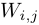
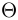
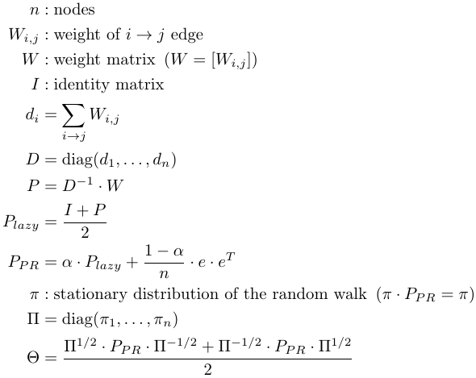

# TilingApplication
This workspace contains c# solution of the problem 'histogram cells to servers' and Python project of the generation of simulated data and related figures.

## CellsToServers
The c# solution 'histogram cells to servers' includes __lp_solve__ as a compiled library which is a _Linear Programming system_ (see: http://web.mit.edu/lpsolve/doc). The citation information is available below.

### lpsolve citation data
Description     : Open source (Mixed-Integer) Linear Programming system

Language        : Multi-platform, pure ANSI C / POSIX source code, Lex/Yacc based parsing

Official name   : lp_solve (alternatively lpsolve)

Release data    : Version 5.1.0.0 dated 1 May 2004

Co-developers   : Michel Berkelaar, Kjell Eikland, Peter Notebaert

Licence terms   : GNU LGPL (Lesser General Public Licence)

Citation policy : General references as per LGPL
                  Module specific references as specified therein

## SimulatedData
The Python project for simulating and plotting data includes __scikit-learn__ (see: http://scikit-learn.org/stable/index.html) for usage of _MDS algorithm_ for sophisticated color management of figure generation. The citation information is available below.

### scikit-learn citation data
Scikit-learn: Machine Learning in Python, Pedregosa et al., JMLR 12, pp. 2825-2830, 2011.

## SpectralClustering
This c# solution 'spectral clustering for directed network' is based on the below-mentioned articles (see: [References](https://github.com/szalaigj/TilingApplication#references)). It includes __MathNet.Numerics__ (see: http://numerics.mathdotnet.com/) which is used for tasks of _Linear Algebra_ topics. This will be used for another approach of the original problem.

See [Notations](https://github.com/szalaigj/TilingApplication#notations) for the followings:
* __Input__: file which contains weights 
* __Output__: clusters of the directed network
1. Form the matrix 
2. Compute the eigenvector which belongs to the second largest eigenvalue. Thereafter split the node set into two parts based on this vector. (If a coordinate of the vector is non-negative the related node will belong to the one part otherwise to the other part.)
3. Repeat steps 1. and 2. for the parts while the needed condition is satisfied.

### Notations

### References
* _Gleich, David. "Hierarchical directed spectral graph partitioning." Tech. rep., Stanford University (2006)._
* _Malliaros, Fragkiskos D., and Michalis Vazirgiannis. "Clustering and community detection in directed networks: A survey." Physics Reports 533.4 (2013): 95-142._